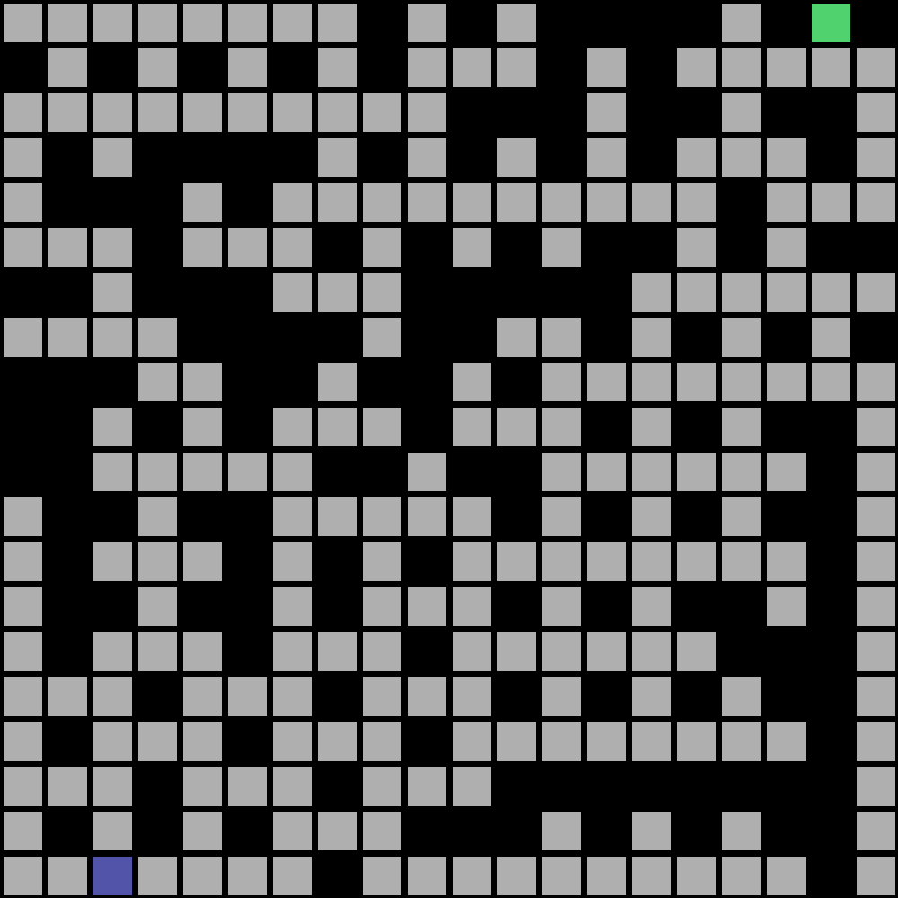
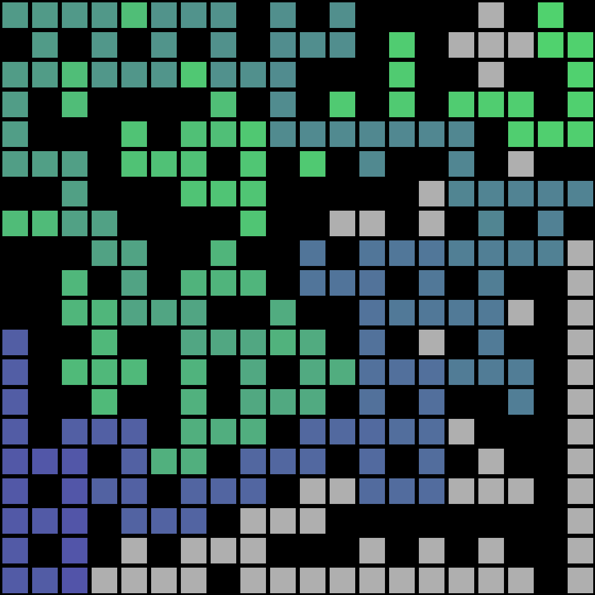
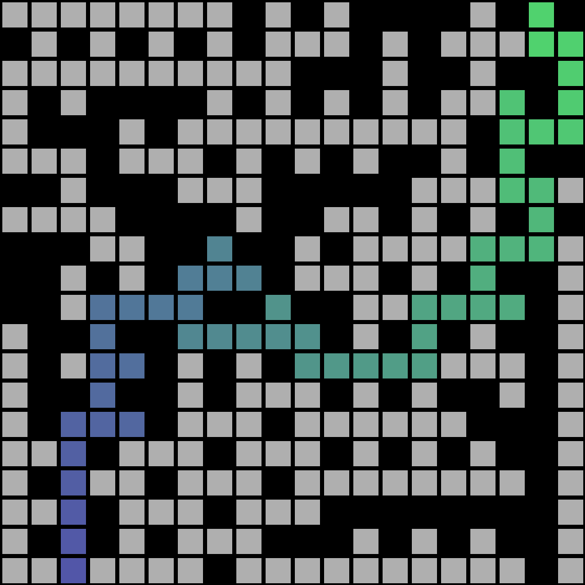

# search_algorithms

From-scratch scenario generation for search algorithms testing.

## Installation

### UNIX

``` bash
# Download:
git clone https://github.com/erlete/search-algorithms
cd search-algorithms

# Optional (virtual environment creation):
python3 -m pip install venv
python3 -m venv .venv
source ./.venv/bin/activate

# Module installation and script execution:
python3 -m pip install matplotlib Pillow
python3 inspector_tests.py
```

### Windows

```bash
# Download:
git clone https://github.com/erlete/search-algorithms
cd search-algorithms

# Module installation and script execution:
python3 -m pip install matplotlib Pillow
python3 inspector_tests.py
```

## Guide

This repository serves as scenario-generator for search algorithms (quite) unbiased testing. Its goal is to help users experiment with 2-dimensional arrays (from now on, **mazes**) that can contain several types of elements (from now on, **nodes**).

### Nodes

The `Node` is a data structure that eases the process of locating points in the maze and set specific qualities for them. Nodes have several attributes:

* Coordinates (`Node.coordinates` -> `tuple[int, int]`)
	* Coordinate X (`Node.X` -> `int`)
	* Coordinate Y (`Node.Y` -> `int`)
* State (`Node.state` -> `int`)
* Color (`Node.color` -> `tuple[int, int, int]`, RGB format)

The `coordinates` attribute determines where a node is located in the maze. The `state` attribute is an integer value that determines "what" the node represents, given a specific mapping for these values. Finally, the `color` attribute sets the colorized representation of said node in an RGB format.

_Note that the coordinate system used for this representation has its origin `(0, 0)` in the top left corner of the canvas. Also, the `X` coordinate of a node determines its column number, while the `Y` coordinate determines its row number._

### Maze

Regarding the `Maze`, its functionality is to organize, update and interpret each node's attributes. Originally, a blank canvas is created (a 2-dimensional array) and each node is initialized to its coordinates in the array (row and column), a null state (`0`) and a base color, `(0, 0, 0)`. Once the base maze has been generated, a **`start`** node is scattered along its base nodes (**walls**). This node will mark the origin of the path generation method, which takes place in the next step of the process. Other attributes are set in this step as well, such as color picking, dimensional settings, etc.

Right after the base generation process, a `path_generator` method is invoked. The objective of this method is, as its name indicates, to generate **path** nodes through which the search algorithms can make their way. This works by carefully selecting specific wall nodes (given a a set of conditions) in order to change their `state` and turn them into actual path nodes.

When the `path_generator` process comes to an end, the **`end`** node is scattered along the coordinates of the path nodes (instead of walls, as in the `start` node case). This is done while trying to spread both `start` and `end` nodes as faw away as possible, while guaranteeing that the maze will always have an end (although there is a chance that this changes in future releases).

At this point, there are four types of nodes in the maze: wall, path, `start`, `end`. The fifth type, **explored**, is generated during the execution of the search algorithms, which are explained below.

### Search algorithms

Currently, two search algorithms have been implemented to the script, **DFS** and **GBFS**. These algorithms work by taking nodes from an array (that contains all the nodes next to the ones that have been previously explored), adding them to a list of explored nodes and evaluating the conditions of the surrounding nodes. During this process, the algorithm might perform intermediate operations used for biasing the path that they are following.

Primitive algorithms do not usually consider other factors apart from the existance of nodes next to the one that is being taken as pivot. This makes them slow and often imprecise. More advanced algorithms, however, take one or many variables into account (cartesian or radial distances to the end, path costs and many other factors, depending on the are of application of the algorithm). This feature allows them to be sizably faster and more reliable than primitive search algorithms.

#### Depth-First Search (DFS)

This might be the most basic algorithm that can be developed. When given a node as a frontier, it checks for surrounding nodes and selects one of them. When reaching that next node, it repeats the process until it reaches and endpoint (which might be the solution or the complete exhaustion of path nodes in the maze) without taking into account any biasing factors.

#### Greedy Best-First Search (DFS)

Opposite to the DFS, the GBFS takes into account the **manhattan distance** (sum of cartesian coordinates' difference) from each evaluated node to the `end` (which equals the _weight_ of said node). This guarantees that the algorithm always selects nodes that are closer to the `end` node, since the selected node will have the lowest weight of the frontier array.

### Display

Once the maze has been generated (and searched, optionally), it can be displayed. There are two display methods available: `ascii` and `image`. While the `ascii` one returns an ASCII representation of the current state of the whole maze, the `image` generates a colored image that can be shown and/or saved (depending on the method parameters). Since the ASCII representation might not fit on the screen for higher dimensions of the maze (line breaks due to horizontal size overflow), the image representation ensures that the maze is fully visible, although it takes more resources than the ASCII one.

## Examples

### Base maze



***

### Searched maze (DFS)



***

### Searched maze (GBFS)


